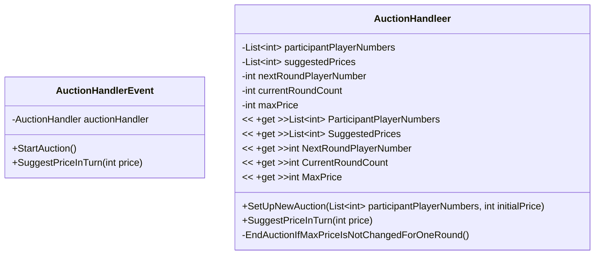
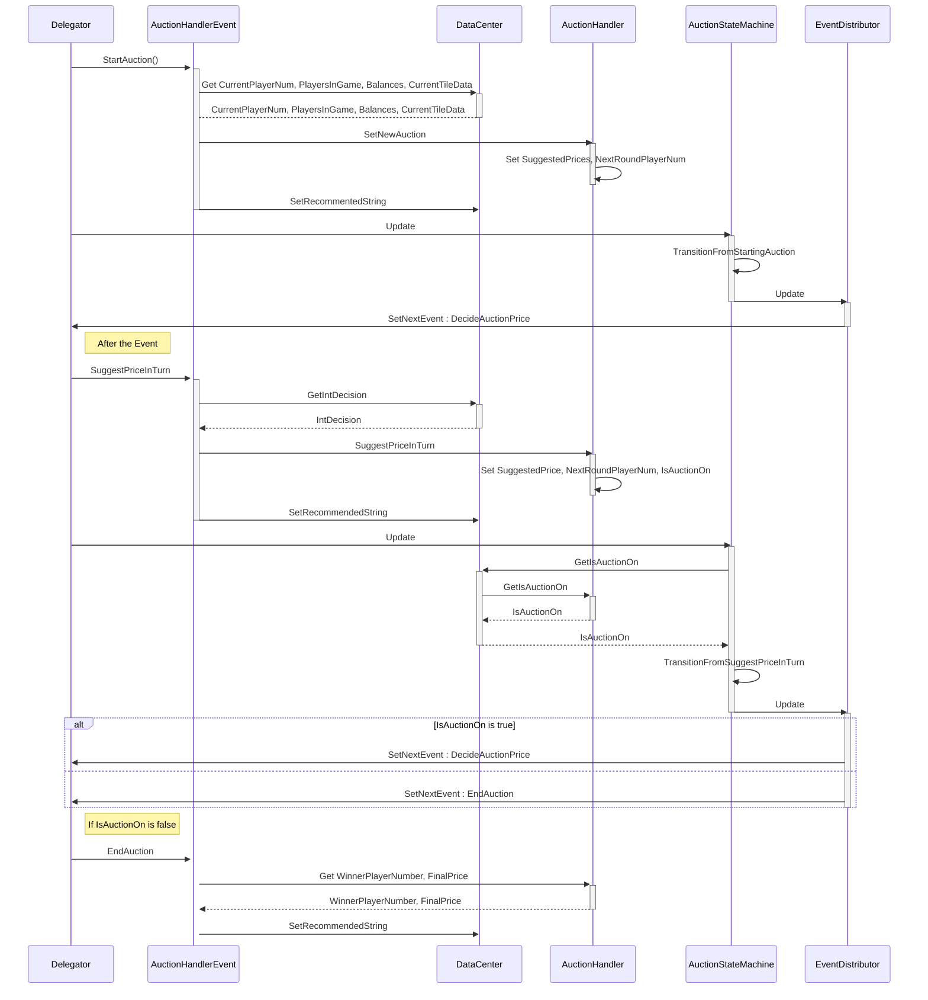

```mermaid
classDiagram
class AuctionHandlerEvent{
    -AuctionHandler auctionHandler
    
    +StartAuction()
    +SuggestPriceInTurn(int price)
}
class AuctionHandleer{
    -List~int~ participantPlayerNumbers
    -List~int~ suggestedPrices
    -int nextRoundPlayerNumber
    -int currentRoundCount
    -int maxPrice
    +SetUpNewAuction(List~int~ participantPlayerNumbers, int initialPrice)
    +SuggestPriceInTurn(int price)
    -EndAuctionIfMaxPriceIsNotChangedForOneRound()
    << +get >>List~int~ ParticipantPlayerNumbers
    << +get >>List~int~ SuggestedPrices
    << +get >>int NextRoundPlayerNumber
    << +get >>int CurrentRoundCount
    << +get >>int MaxPrice
}
```

```mermaid
sequenceDiagram
Delegator->>+AuctionHandlerEvent : StartAuction()

activate AuctionHandlerEvent
AuctionHandlerEvent->>+DataCenter : Get CurrentPlayerNum, PlayersInGame, Balances, CurrentTileData
DataCenter-->-AuctionHandlerEvent : CurrentPlayerNum, PlayersInGame, Balances, CurrentTileData
AuctionHandlerEvent->>AuctionHandler : SetNewAuction
activate AuctionHandler
AuctionHandler->>AuctionHandler : Set SuggestedPrices, NextRoundPlayerNum
deactivate AuctionHandler
AuctionHandlerEvent->>DataCenter : SetRecommentedString
deactivate AuctionHandlerEvent

Delegator ->> AuctionStateMachine : Update

activate AuctionStateMachine
AuctionStateMachine->>AuctionStateMachine : TransitionFromStartingAuction
AuctionStateMachine->>EventDistributor : Update
deactivate AuctionStateMachine

activate EventDistributor
EventDistributor->>Delegator : SetNextEvent : DecideAuctionPrice
deactivate EventDistributor

Note right of Delegator : After the Event
Delegator->>AuctionHandlerEvent : SuggestPriceInTurn
activate AuctionHandlerEvent
AuctionHandlerEvent->>+DataCenter : GetIntDecision
DataCenter-->>-AuctionHandlerEvent : IntDecision
AuctionHandlerEvent->>AuctionHandler : SuggestPriceInTurn
activate AuctionHandler
AuctionHandler ->> AuctionHandler : Set SuggestedPrice, NextRoundPlayerNum, IsAuctionOn
deactivate AuctionHandler
AuctionHandlerEvent->>DataCenter : SetRecommendedString
deactivate AuctionHandlerEvent

Delegator ->> AuctionStateMachine : Update

activate AuctionStateMachine
AuctionStateMachine->>+DataCenter : GetIsAuctionOn
DataCenter->>+AuctionHandler : GetIsAuctionOn
AuctionHandler-->>-DataCenter : IsAuctionOn
DataCenter-->>-AuctionStateMachine : IsAuctionOn
AuctionStateMachine->>AuctionStateMachine : TransitionFromSuggestPriceInTurn
AuctionStateMachine->>EventDistributor : Update
deactivate AuctionStateMachine

activate EventDistributor
alt IsAuctionOn is true
    EventDistributor->>Delegator : SetNextEvent : DecideAuctionPrice
else
    EventDistributor->>Delegator : SetNextEvent : EndAuction
end
deactivate EventDistributor

Note right of Delegator : If IsAuctionOn is false
Delegator->>AuctionHandlerEvent : EndAuction

activate AuctionHandlerEvent
AuctionHandlerEvent->>+AuctionHandler : Get WinnerPlayerNumber, FinalPrice
AuctionHandler-->>-AuctionHandlerEvent : WinnerPlayerNumber, FinalPrice
AuctionHandlerEvent->>DataCenter : SetRecommendedString
```
