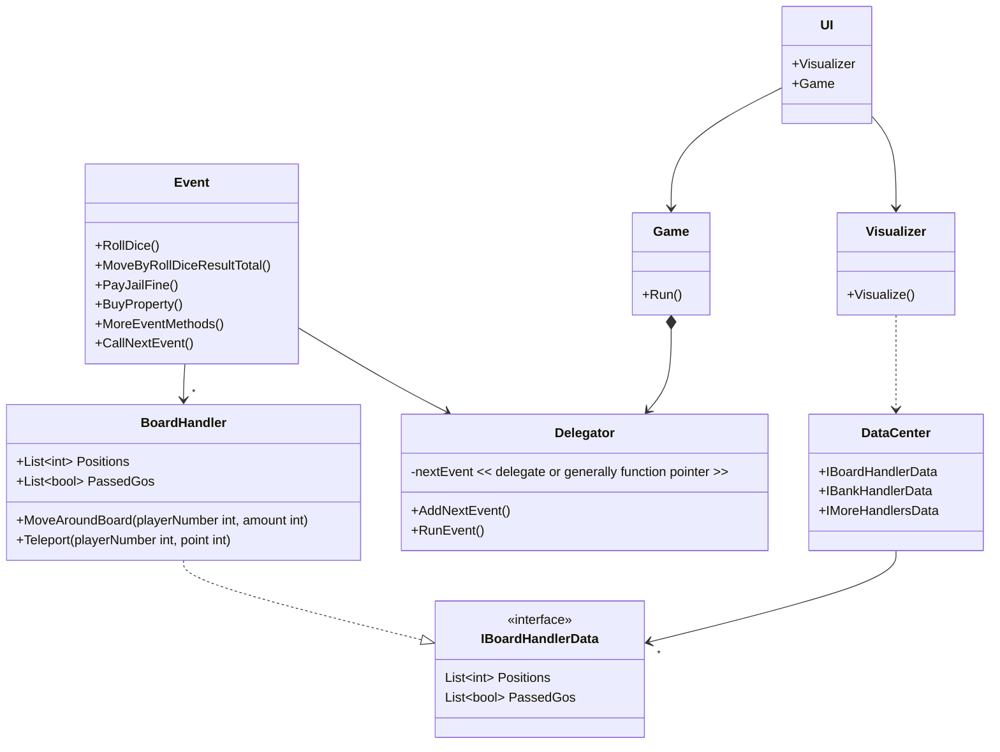
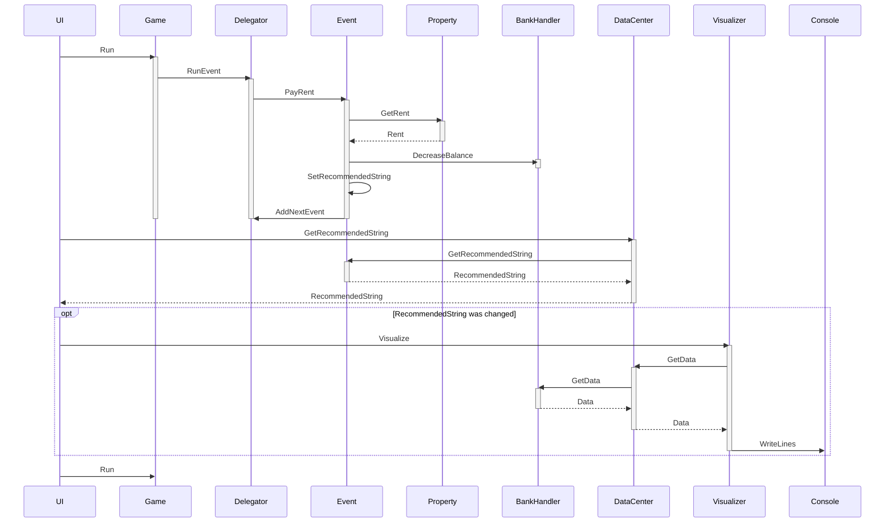

# MonopolyWithCSharp

0. There are UML diagrams below

1. For fun, please check the "prototpye.gif" file

2. If you want to try the demo version,
  - open this project with VSCode
  - execute "dotnet build" in your terminal command line (of course without the double quotation marks)
  - make your terminal as big as possible
  - press f5
  - It is checked that some lines are not working in Visual Studio, therefore Visual Studio Code is only checked if it is executable for now.

3. Current features
  - auto game play
  - repeating turns
  - purchasing property
  - paying rent
  - auction event
  - trade event

5. Planned features
  - house build event
  - mortgage event
  - force a poor's property auction event
  - user interface
  - AI
  - Monopoly with WPF

6. Currently two different sized maps are serviced. The bigger map won't work with normal sized monitors.
   The default size is the smaller map. To change the size,
  - go to src/UI/Program.cs
  - change the value "isBoardSmall" to false

The class diagram for the current Monopoly Demo version

The sequence diagram for the current Monopoly Demo version
  - Other handlers like BankHandler in the diagram play similar rules at the same position.

DONTREADME :
Ha... I still think it is not difficult to make Monopoly if my goal is just to make it work.
It is totally different if I try to make it perfect as much as possible.
I began to use interfaces quite recently, and unfortunately I already wrote lots of lines without them.
It is literally imposible to make unit tests for high-level classes without them.
My Event class makes it worse because it is too large to test properly.
It is why I have to refactor them before studying the machine learning for AI.
As hard as I recently studied, I learned a lot, and I like to apply new knowledge,
however things to learn are infinite and time to learn is finite. :(
