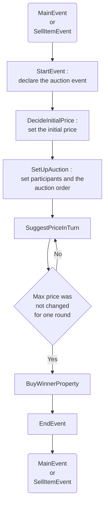

```mermaid
flowchart TB
    T(MainEvent \n or \n SellItemEvent)  --> A
    A[StartEvent : \n declare the auction event] --> B[DecideInitialPrice : \n set the initial price]
    B --> C[SetUpAuction : \n set participants and the auction order]
    C --> D[SuggestPriceInTurn]
    D --> E{Max price was \n not changed \n for one round}
    E -- No --> D
    E -- Yes --> F[BuyWinnerProperty]
    F --> G[EndEvent]
    G --> H(MainEvent \n or \n SellItemEvent)
```
