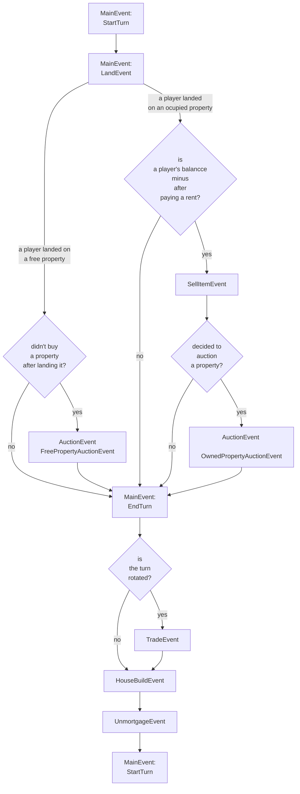

This flow chart shows the order of events.

Events with semicolons should be refactored. 
1. MainEvent should be devided into more pieces.
2. Two different auction events can be derived from the current AuctionEvent

