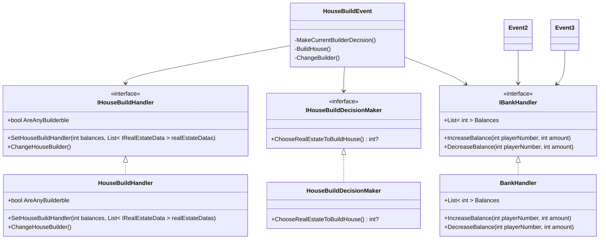

```mermaid
classDiagram
class HouseBuildEvent{
    -MakeCurrentBuilderDecision()
    -BuildHouse()
    -ChangeBuilder()
}
class BankHandler{
    +List< int > Balances
    +IncreaseBalance(int playerNumber, int amount)
    +DecreaseBalance(int playerNumber, int amount)
}
class HouseBuildHandler{
    +SetHouseBuildHandler(int balances, List< IRealEstateData > realEstateDatas)
    +bool AreAnyBuilderble
    +ChangeHouseBuilder()
}
class IHouseBuildHandler{
    <<interface>>
    +SetHouseBuildHandler(int balances, List< IRealEstateData > realEstateDatas)
    +bool AreAnyBuilderble
    +ChangeHouseBuilder()
}
class HouseBuildDecisionMaker{
    +ChooseRealEstateToBuildHouse() int?
}
class IBankHandler{
    <<interface>>
    +List< int > Balances
    +IncreaseBalance(int playerNumber, int amount)
    +DecreaseBalance(int playerNumber, int amount)
}
class IHouseBuildDecisionMaker{
    <<inferface>>
    +ChooseRealEstateToBuildHouse() int?
}

HouseBuildEvent --> IHouseBuildHandler
HouseBuildEvent --> IHouseBuildDecisionMaker
HouseBuildEvent --> IBankHandler
IBankHandler <|.. BankHandler
IHouseBuildDecisionMaker <|.. HouseBuildDecisionMaker
IHouseBuildHandler <|.. HouseBuildHandler
Event2 --> IBankHandler
Event3 --> IBankHandler
```