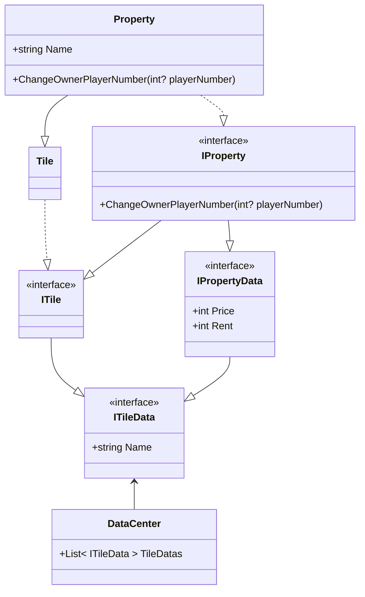

```mermaid
classDiagram
class Property{
    +string Name
    +ChangeOwnerPlayerNumber(int? playerNumber)
}
class DataCenter{
    +List< ITileData > TileDatas
}
class IProperty{
    <<interface>>
    +ChangeOwnerPlayerNumber(int? playerNumber)
}
class IPropertyData{
    <<interface>>
    +int Price
    +int Rent
}
class ITile{
    <<interface>>
}
class ITileData{
    <<interface>>
    +string Name
}

Tile ..|> ITile
ITile --|> ITileData
Property --|> Tile
IProperty --|> IPropertyData
IProperty --|> ITile
IPropertyData --|> ITileData
Property ..|> IProperty

ITileData <-- DataCenter
```
