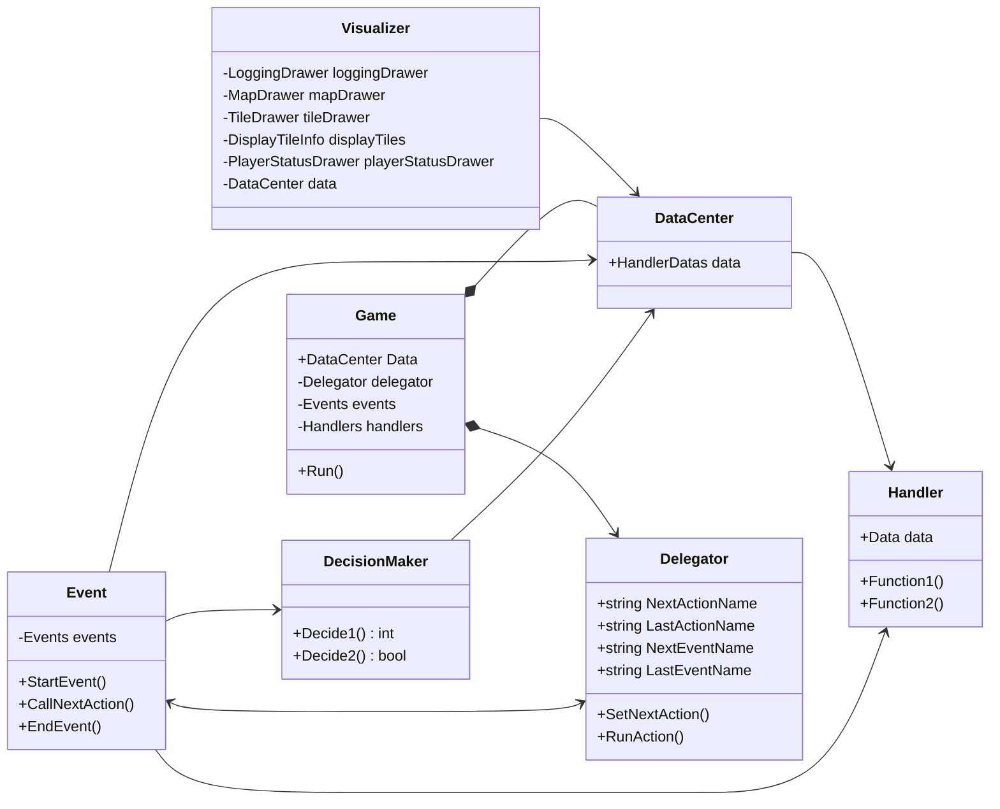

```mermaid
classDiagram
class Game{
    +DataCenter Data
    -Delegator delegator
    -Events events
    -Handlers handlers
    +Run()
}

class DataCenter{
    +HandlerDatas data
}

class Event{
    -Events events
    +StartEvent()
    +CallNextAction()
    +EndEvent()
}

class Visualizer{
    -LoggingDrawer loggingDrawer
    -MapDrawer mapDrawer
    -TileDrawer tileDrawer
    -DisplayTileInfo displayTiles
    -PlayerStatusDrawer playerStatusDrawer
    -DataCenter data
}

class Delegator{
    +string NextActionName
    +string LastActionName
    +string NextEventName
    +string LastEventName
    +SetNextAction()
    +RunAction()
}

class Handler{
    +Data data
    +Function1()
    +Function2()
}

class DecisionMaker{
    +Decide1() int
    +Decide2() bool
}

direction TD
Visualizer --> DataCenter
Game *-- DataCenter
Game *--> Delegator
DataCenter --> Handler
Event --> DataCenter
Event --> Handler
Event <--> Delegator
direction LR
Event --> DecisionMaker
DecisionMaker --> DataCenter

```
