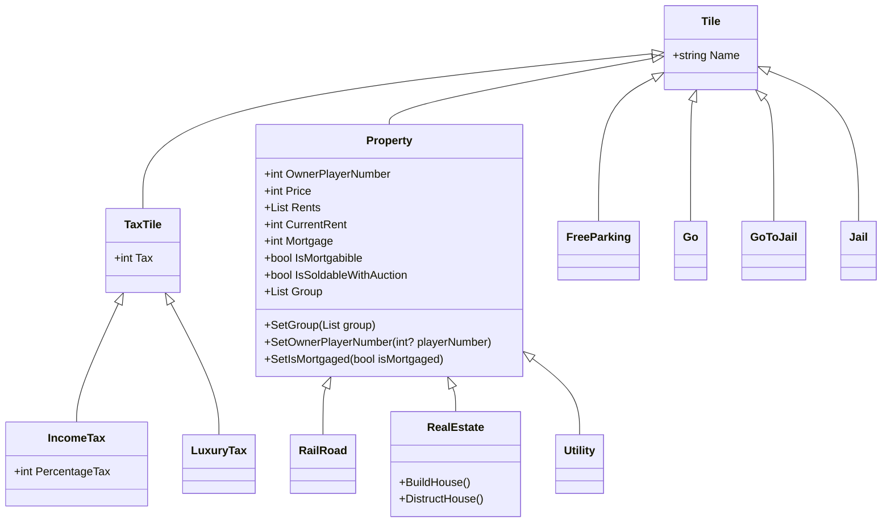

```mermaid
classDiagram
class Tile{
    +string Name
}
class TaxTile{
    +int Tax
}
class IncomeTax{
    +int PercentageTax
}
class Property{
    +int OwnerPlayerNumber
    +int Price
    +List<int> Rents
    +int CurrentRent
    +int Mortgage
    +bool IsMortgabible
    +bool IsSoldableWithAuction
    +List<IProperty> Group
    +SetGroup(List<IProperty> group)
    +SetOwnerPlayerNumber(int? playerNumber)
    +SetIsMortgaged(bool isMortgaged)
}

class RealEstate{
    +BuildHouse()
    +DistructHouse()
}

Tile <|-- FreeParking
Tile <|-- Go
Tile <|-- GoToJail
Tile <|-- Jail
Tile <|-- TaxTile
TaxTile <|-- IncomeTax
TaxTile <|-- LuxuryTax
Tile <|-- Property
Property <|-- RailRoad
Property <|-- RealEstate
Property <|-- Utility
```
