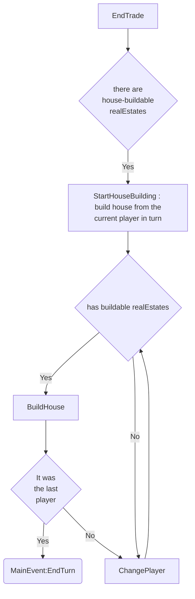

```mermaid
flowchart TB
    A[EndTrade] --> B{there are \n house-buildable \n realEstates}

    B -- Yes --> C[StartHouseBuilding : \n build house from the current player in turn]

    C --> D{has buildable realEstates}

    D -- Yes --> E[BuildHouse]

    E --> G{It was \n the last \n player}

    D -- No --> F[ChangePlayer]

    G -- Yes --> H(MainEvent:EndTurn)

    G -- No --> F

    F --> D
```