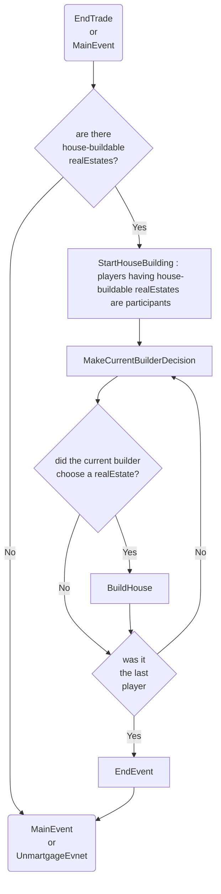

UnmortgageEvent works very similar as HouseBuildEvent does. Refactor them to be derived classes from one 'UpgradePropertyEvent' class

```mermaid
flowchart TB


    A(EndTrade \n or \n MainEvent) --> B{are there \n house-buildable \n realEstates?}

    B -- Yes --> C[StartHouseBuilding : \n players having house-buildable realEstates \n are participants]

    B -- No --> H

    C--> J[MakeCurrentBuilderDecision]

    J --> I{did the current builder \n choose a realEstate? }

    I -- Yes --> E[BuildHouse]

    I -- No --> G

    E --> G{was it \n the last \n player}

    G -- Yes --> K

    K[EndEvent] --> H(MainEvent \n or \n UnmartgageEvnet)

    G -- No --> J

```