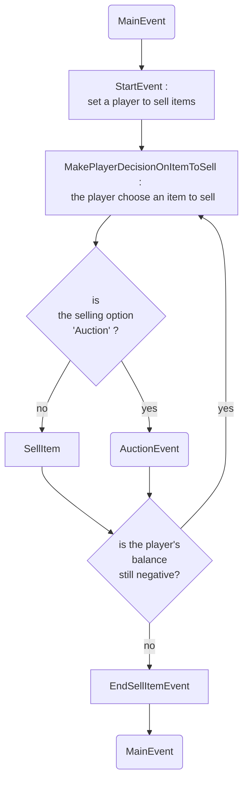

```mermaid
flowchart TB
A["StartEvent : \n set a player to sell items"]
B["MakePlayerDecisionOnItemToSell : \n the player choose an item to sell"]
C["SellItem"]
D["EndSellItemEvent"]
E("AuctionEvent")
F("MainEvent")
G("MainEvent")

a{"is the player's \n balance \n still negative?"}
b{"is \n the selling option \n 'Auction' ?"}

F --> A
A --> B
B --> b
C --> a
b -- no --> C
b -- yes --> E
E --> a
a -- yes --> B
a -- no --> D
D --> G
```