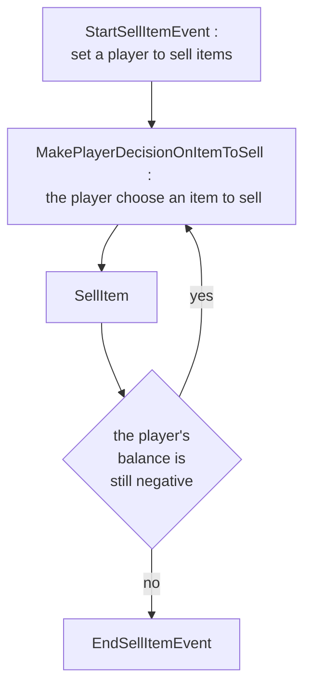

```mermaid
flowchart TB
A["StartSellItemEvent : \n set a player to sell items"]
B["MakePlayerDecisionOnItemToSell : \n the player choose an item to sell"]
C["SellItem"]
a{"the player's \n balance is \n still negative"}
D["EndSellItemEvent"]

A --> B
B --> C
C --> a
a -- yes --> B
a -- no --> D
```