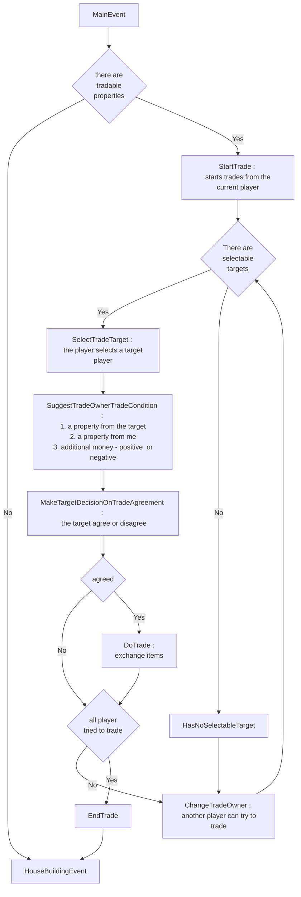

```mermaid
flowchart TB
    A[MainEvent] --> L{there are \n tradable \n properties}

    L -- No --> K

    L -- Yes --> B[StartTrade : \n starts trades from the current player]

    B --> M{There are \n selectable \n targets}
    
    M -- Yes --> C[SelectTradeTarget : \n the player selects a target player]

    M -- No --> N[HasNoSelectableTarget]

    N --> I

    C --> D[SuggestTradeOwnerTradeCondition : \n 1. a property from the target \n 2. a property from me \n 3. additional money - positive  or negative]
    D --> E[MakeTargetDecisionOnTradeAgreement : \n the target agree or disagree]
    E --> F{agreed}
    F -- No --> H{all player \n tried to trade}
    F -- Yes --> G[DoTrade : \n exchange items]

    G --> H
    H -- No --> I[ChangeTradeOwner : \n another player can try to trade]
    I --> M
    H -- Yes --> J[EndTrade]
    J --> K[HouseBuildingEvent]
```
