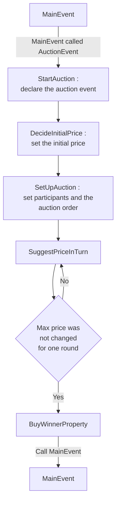

```mermaid
flowchart TB
    T[MainEvent] -- MainEvent called AuctionEvent --> A
    A[StartAuction : \n declare the auction event] --> B[DecideInitialPrice : \n set the initial price]
    B --> C[SetUpAuction : \n set participants and the auction order]
    C --> D[SuggestPriceInTurn]
    D --> E{Max price was \n not changed \n for one round}
    E -- No --> D
    E -- Yes --> F[BuyWinnerProperty]
    F -- Call MainEvent --> G[MainEvent] 
```
